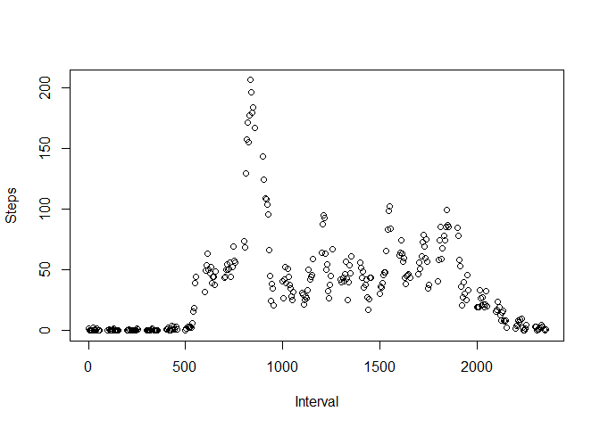
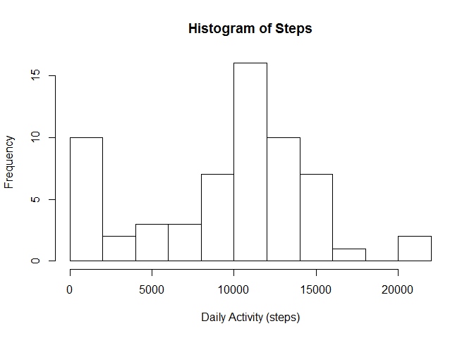
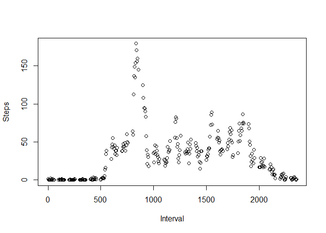
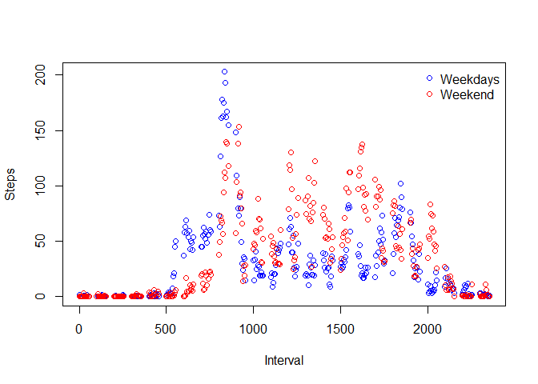
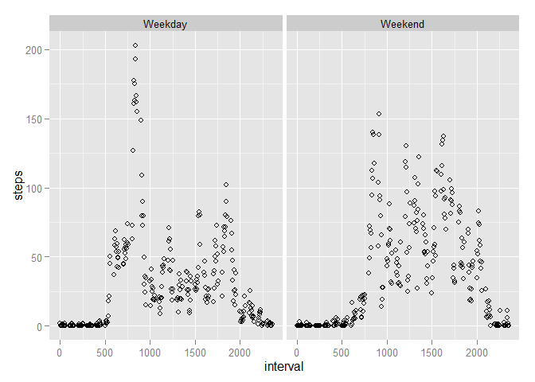

# Reproducible Research: Peer Assessment 1


## Loading and preprocessing the data
First, I need to make sure that you have the necessary packages installed on your computer.

```r
if (!require('ggplot2') | !require("RCurl") | !require("dplyr")){
  print('packages ggplot2, RCurl, and dplyr are required to run this code,
        Please install them on your computer and re-run the code')
  return
}
```

```
## Loading required package: ggplot2
```

```
## Warning: package 'ggplot2' was built under R version 3.1.2
```

```
## Loading required package: RCurl
```

```
## Warning: package 'RCurl' was built under R version 3.1.2
```

```
## Loading required package: bitops
```

```
## Warning: package 'bitops' was built under R version 3.1.2
```

```
## Loading required package: dplyr
```

```
## Warning: package 'dplyr' was built under R version 3.1.2
```

```
## 
## Attaching package: 'dplyr'
## 
## The following object is masked from 'package:stats':
## 
##     filter
## 
## The following objects are masked from 'package:base':
## 
##     intersect, setdiff, setequal, union
```

Then I check if you have the csv.  If not, I check if you have the zip.  If not, I download the zip.  Once I am sure you have the zip, I unzip it.  Once I am sure you have the .csv, I read it.


```r
cache_dir <- getwd()
zip_name <- paste0(cache_dir,'/','repdata-data-activity.zip')
csv_name <- paste0(cache_dir,'/','activity.csv')
fex <- file.exists(csv_name,zip_name)

if(!any(fex)){
  zip_url <- 'https://d396qusza40orc.cloudfront.net/repdata%2Fdata%2Factivity.zip'
  zip_bin <- getBinaryURL(zip_url,ssl.verifypeer = FALSE)
  zip_file <- file(zip_name,open="wb")
  writeBin(zip_bin,zip_file)
  close(zip_file)
  fex <- file.exists(csv_name,zip_name)
}
if (!fex[1]){
  unzip(zipfile = zip_name)
}
d <- read.csv(csv_name, na.string="NA", sep=",")
```


### Extracting the relevant data: step 1 & 2's target dataset
First step is to clear the NA's out of the dataset.  This will actually remove several days from the analysis, assumedly before the subject had begun wearing the device.  We first sort the data by date and by interval.  All that is asked of us for the interval sorting is the mean.

```r
d_NA_strip = filter(d, !is.na(steps))

tot_stp_NA_strip = aggregate(d_NA_strip$steps,list(date = d_NA_strip$date),sum)
avg_stp_NA_strip = aggregate(d_NA_strip$steps, list(interval = d_NA_strip$interval), mean)

avg_tot_stp_day_strip_NA = mean(tot_stp_NA_strip$x)
md_tot_stp_day_strip_NA  = median(tot_stp_NA_strip$x)
```


## What is mean total number of steps taken per day?

The mean number of steps per day, and the median number of steps per day for the entire dataset, NA's exluded, are:

```r
print(avg_tot_stp_day_strip_NA)
```

```
## [1] 10766.19
```

```r
print(md_tot_stp_day_strip_NA)
```

```
## [1] 10765
```
respectively, and the most active 5 minute interval is:

```r
max_int = (avg_stp_NA_strip$x == max(avg_stp_NA_strip$x))
max_int_hour = avg_stp_NA_strip$interval[max_int]%/%100
max_int_minute = avg_stp_NA_strip$interval[max_int]%%100
print(paste('Interval ',avg_stp_NA_strip$interval[max_int]/5,': ',
            'from ',max_int_hour,':',max_int_minute,' through ',
            max_int_hour,':',max_int_minute+5))
```

```
## [1] "Interval  167 :  from  8 : 35  through  8 : 40"
```


## What is the average daily activity pattern?

```r
hist(tot_stp_NA_strip$x,xlab = "Daily Activity (steps)",ylab = "Frequency",
     main = "Histogram of Steps",breaks = 10)
```

 

```r
plot(avg_stp_NA_strip$interval,avg_stp_NA_strip$x,xlab = 'Interval',ylab = 'Steps')
```

 


## Imputing missing values
Many entries have 'NA' as a value.  In fact, some days have NO steps entered, and they are not represented in the previous data (for instance, the NA-filtered dataset begins on day 2!).  We will use the average value of the recorded steps for that interval as the relacement value.  This will have the effect of not changing the average value for any interval measured.  It *WILL* change the total steps taken on that day, the average and median steps/day.  However, the other options, mean/median per day would all have the same (or similar) effects.  The current assumption, however, that there were NO steps taken during the NA intervals is almost definitely wrong, and represents a minimum estimate.  A slightly larger one will likely be more representative of reality.

Any days with  ONLY NA values will be replaced with zero first, as averaging a zero length array will probably give problems.


```r
num_NA = length(d$steps)-length(d_NA_strip$steps)
FULL_NA_FILTER = !(d$date %in% d_NA_strip$date)
d$steps[FULL_NA_FILTER] = 0
```

The total number of NA's (before filling in the blank days) is:

```r
print(num_NA)
```

```
## [1] 2304
```

I now replace the NAs with the average value/interval.  I prefer for loops for complicated work, as I learned to code on a more general language, and practicing 'apply' won't help in C, Python, or Java.


```r
NAs = is.na(d$steps)
for( st_na in seq_along(d$steps[NAs])){
  interv = d$interval[NAs][st_na]
  d$steps[NAs][st_na] = avg_stp_int_omit_NA$x[avg_stp_int_omit_NA$interval == interv]
}
```


```r
tot_stp_day = aggregate(d$steps, list(date = d$date), sum)
avg_tot_stp_day = mean(tot_stp_day$x)
md_tot_stp_day  = median(tot_stp_day$x)

avg_stp_int = aggregate(d$steps, list(interval = d$interval), mean)
```

The mean number of steps per day, and the median number of steps per day for the entire dataset, NA's filled in, are:

```r
print(avg_tot_stp_day)
```

```
## [1] 9354.23
```

```r
print(md_tot_stp_day)
```

```
## [1] 10395
```
respectively, and the most active 5 minute interval is:

```r
max_int = avg_stp_int$x == max(avg_stp_int$x)
print(paste('Interval ',avg_stp_int$interval[max_int]/5,
            ': minutes ',avg_stp_int$interval[max_int],
            ' through ',avg_stp_int$interval[max_int]+5, sep = ' '))
```

```
## [1] "Interval  167 : minutes  835  through  840"
```
as expected, the average was changed, as we are averaging over a few days that contribute zero to the sum.  The median was not significantly changed, as would be expected, since the presence of a few new zero days would be offset by higher numbers across the board on the rest of the days.  And the most active interval is still, obviously, the same
## Are there differences in activity patterns between weekdays and weekends?
And I then repeat the averaging and plotting above, but with my new, NA-filled dataset As you can see, the 0 step bin has filled in significantly higher, while the rest of the histogram is roughly unchanged


```r
#This is a rather backasswards way of listing the days on the barplot x-axis.  As always fault lays with R for it's failings.
hist(tot_stp_day$x,xlab = "Daily Activity (steps)",ylab = "Frequency",
     main = "Histogram of Steps",breaks = 10)
```

 

```r
plot(avg_stp_int$interval,avg_stp_int$x,xlab = 'Interval',ylab = 'Steps')
```

 


###Analysis: Differences between weekdays and weekends
Finally we look at our new dataset to see if there is any correlation between activity and day of the week.  We're supposed to do a panel plot, but I've chosen to also represent the data overlaid, as that's how you would actually note any differences.


```r
days <- weekdays(as.Date(d$date))
weekend_filter = ((days=='Saturday') | (days=='Sunday'))
days[weekend_filter] = 'Weekend'
days[!weekend_filter] = 'Weekday'
d$weekday = factor(days)

avg_stp_wk_int = aggregate(d$steps, by = list(d$interval,d$weekday), mean)
colnames(avg_stp_wk_int) = c('interval','weekday','steps')
plot(avg_stp_wk_int$interval[avg_stp_wk_int$weekday == 'Weekday'],
     avg_stp_wk_int$steps[avg_stp_wk_int$weekday == 'Weekday'],col  ='blue',
     xlab = 'Interval',ylab = 'Steps')
points(avg_stp_wk_int$interval[avg_stp_wk_int$weekday == 'Weekend'],
     avg_stp_wk_int$steps[avg_stp_wk_int$weekday == 'Weekend'],col  ='red')
legend("topright", bty="n", pch = 1,col=c( "blue",'red'),
       legend=c("Weekdays", "Weekend"))
```

 

```r
sp <- ggplot(avg_stp_wk_int, aes(x=interval, y=steps)) + geom_point(shape=1)
sp + facet_grid(. ~ weekday)
```

 

As we would expect, the person wearing the monitor is inactive until later in the morning on the weekends, but is active until later at night. (S)He is much busier, much earlier on the weekdays, but seems to have a higher sustained activity level on the weekends.
